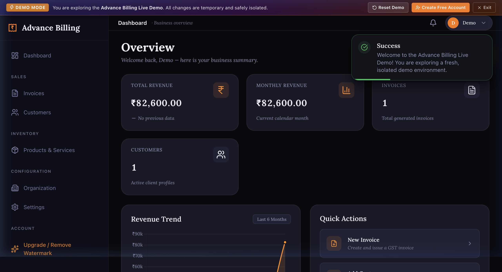
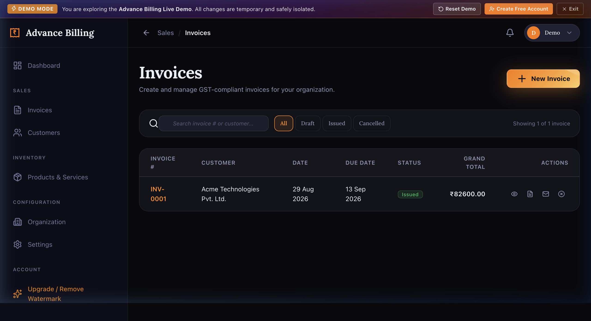
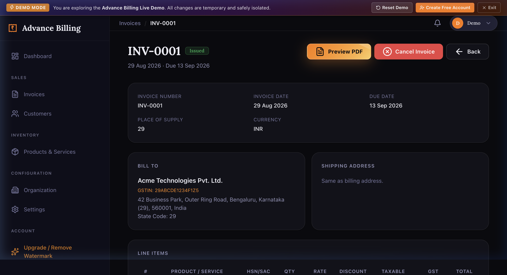
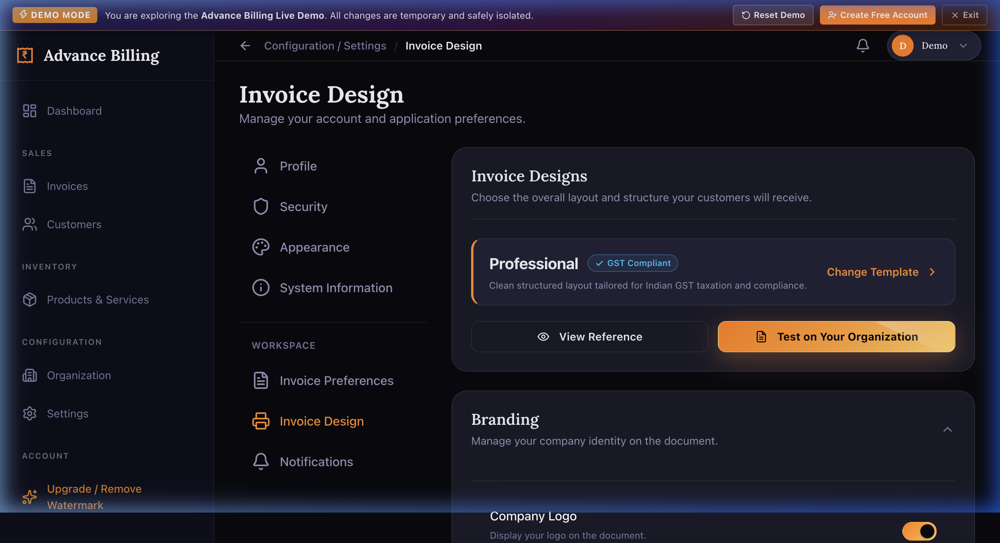

# Advance Billing

> GST invoice and billing management platform built for Indian businesses.

[](https://python.org)
[](https://djangoproject.com)
[](https://postgresql.org)
[](https://redis.io)
[](https://weasyprint.org)
[](https://render.com)

**[→ Live Application](https://advance-billing-system.onrender.com)**  &nbsp;|&nbsp;  **[→ Try Live Demo](https://advance-billing-system.onrender.com/demo/)**

---

## Screenshots

| Dashboard | Invoices |
|---|---|
|  |  |

| Invoice Detail | Invoice Design |
|---|---|
|  |  |

---

## Overview

Advance Billing is a production Django application for creating and managing GST-compliant tax invoices. It is designed for Indian businesses — sole traders, freelancers, and small companies — that need to generate professional PDF invoices, manage reusable customer and product records, handle GST calculations correctly, and maintain organised business data.

The system handles the complete invoice lifecycle: from drafting with multiple line items, through GST calculation (CGST/SGST for intra-state or IGST for inter-state), to PDF generation and email delivery. It includes a multi-tenant data isolation model, automated weekly data backups, an in-application notification system, and production-grade engineering safeguards throughout.

Every user account is associated with exactly one Organisation. All invoices, customers, products, settings, backups, and notifications are strictly scoped to that organisation.

---

## Why Advance Billing?

Creating compliant GST invoices manually is tedious and error-prone. Off-the-shelf tools either carry large subscription costs or lack the specific HSN/SAC, CGST/SGST/IGST, and Place of Supply handling required under Indian GST law.

Advance Billing was built to solve this concretely:

- **Correct calculation, not just formatting.** The GST engine applies intra-state (CGST + SGST) vs inter-state (IGST) rules per line item, based on the supplier's state code and the invoice's Place of Supply. Both inclusive and exclusive price bases are supported.
- **Snapshot-based invoice integrity.** When an invoice is issued, the product name, HSN/SAC code, GST rate, and customer GSTIN are frozen into the invoice record. Editing product or customer master data later does not alter historical invoices.
- **Professional PDF output.** WeasyPrint renders pixel-accurate invoice PDFs from hand-designed HTML templates. Multiple layout choices allow organisations to match their visual identity.
- **Data you own.** A weekly automated backup delivers a complete JSON + Excel snapshot of the organisation's data directly to the owner's email. Data can also be exported or restored at any time through the data management module.
- **Production engineering throughout.** The application enforces concurrency limits on PDF rendering and export generation, protects against oversized email attachments, rate-limits authentication endpoints, and degrades gracefully if Redis becomes unavailable.

---

## Key Features

### Invoice Management

- Create invoices in **Draft** status; issue them to lock the number and calculations
- Three invoice states: **Draft**, **Issued**, **Cancelled**
- Multiple line items per invoice, each with an independent product, quantity, rate, and discount
- Per-line discount: **percentage** or **fixed amount**
- **Place of Supply** field determines CGST/SGST vs IGST split across all line items
- Separate **billing address** and **shipping address** (or mark shipping same as billing)
- Invoice-level notes and payment terms fields
- Configurable invoice number prefix (e.g. `INV-2026-27-0001`), optional financial year inclusion
- Unique invoice number constraint enforced per organisation

### GST Calculation Engine

- Supports all standard **GST rate slabs**: 0%, 0.1%, 0.25%, 1%, 1.5%, 3%, 5%, 6%, 7.5%, 12%, 18%, 28%
- Four taxability types per product: **Taxable**, **Exempt**, **Nil-rated**, **Non-GST**
- **Intra-state**: CGST (rate/2) + SGST (rate/2)
- **Inter-state**: IGST (full rate)
- **GST Cess**: percentage-based or fixed-amount per unit, calculated separately from GST
- **Inclusive and exclusive** price basis — inclusive prices are back-calculated to extract the tax component
- **Reverse Charge Mechanism** flag per product
- Grand total rounded to the nearest rupee; round-off amount tracked separately

### Invoice Design & PDF Templates

- **14 available invoice templates** — including Professional, Compact, Landscape, Modern, Vintage, Elegant Serif, Minimal Mono, Bold Header, Tech Grid, GenZ, Simple Invoice, Service, MRP Discount, and Letterhead
- Per-template visibility toggles: logo, company header/footer, QR code, bank details, GST summary table, HSN/SAC column, signature, terms, page numbers, print date
- Organisation **logo**, **letterhead background**, **signature image**, and **QR code** uploaded to Cloudinary
- Paper size: A4 or Letter; orientation: Portrait or Landscape
- Font size and table density preferences

### PDF Generation

- WeasyPrint renders PDFs in-memory — no temporary files written to disk
- A **PDFResourceGuard** enforces a maximum of 2 concurrent WeasyPrint renders per process via a bounded semaphore, preventing CPU/RAM exhaustion under load
- Rejected requests receive a controlled HTTP 503 response, not a crash
- PDF bytes are passed directly to HTTP responses (download) or email attachments without permanent storage

### Email Delivery

- Django SMTP backend connected to **Brevo** (`smtp-relay.brevo.com`, port 2525, TLS)
- `EMAIL_TIMEOUT = 10` seconds enforced on all SMTP connections
- Invoice emails dispatched in the background via a **bounded thread pool** (maximum 2 daemon worker threads, queue capacity 100)
- Duplicate job detection: if an invoice email is already in the queue, a second submission is silently dropped
- Delivery state tracked on the invoice: `email_sent`, `email_last_sent_at`, `email_last_status`, `email_last_trigger`, `email_last_error`, `email_recipient`
- Email statuses: `not_sent`, `queued`, `sending`, `sent`, `failed`

### Customer & Product Management

- Reusable **Customer** records: name, GSTIN, GST status, billing address with state code
- Reusable **Product / Service** records: HSN code (goods) or SAC code (services), taxability type, GST rate, cess configuration, price basis, unit price, UQC
- Products support **archiving** (soft delete) without losing invoice line history
- UUID-based public identifiers for both customers and products
- Bank account details per organisation (IFSC and account number validated)

### Data Management

- **JSON export** — complete machine-readable backup of the organisation's data
- **Excel export** — human-readable workbook with Dashboard, README, Organisation, Customers, Customer Addresses, Products, Invoices, and Invoice Items sheets
- **Excel restore** — import customers, products, and invoices from a previously exported Excel backup
- Both export formats embed a signature (`ADVANCE_BILLING_BACKUP`) and schema version for validation before import
- **Export resource guard**: maximum 2 concurrent exports per process; additional requests are rejected with HTTP 503
- Comprehensive **audit log** (`DataManagementAuditLog`) records every export, import, backup, and data deletion event

### Automated Weekly Backups

- Users can opt in to automated weekly email backups per organisation
- Triggered externally via `POST /internal/cron/weekly-backup/` (cron-job.org)
- Endpoint protected by HMAC-safe `X-Cron-Secret` header comparison
- **Idempotency guard**: if a backup was sent in the last 6 days, the scheduled run skips (unless `force=True`)
- **50,000-record limit** enforced before generation begins
- **15 MB combined attachment limit** (JSON + Excel) enforced before sending
- JSON and Excel both validated after generation and before attachment
- Audit trail: `OrganizationBackupLog` records every attempt, status, record count, file size, and recipient
- Per-organisation failure isolation: one failed backup does not prevent others from receiving theirs

### Notification System

- In-application notification feed, scoped per user and organisation
- Five priority levels: Critical, High, Medium, Low, Temporary
- Priority-based retention: Critical retained permanently; billing/organisation events up to 365 days; settings events 60 days
- Maximum 300 notifications per user enforced with progressive oldest-first cleanup by priority

### Authentication

- Standard email + password authentication
- Email verification required before first login
- Forgot password / reset password via signed token
- Password change with OTP-based email change flow
- Rate limiting on signup (`5/m`) and login endpoints via `django-ratelimit` + Redis

### Demo Mode

- Fully isolated live demo accessible without registration
- Demo organisations are ephemeral and reset-safe
- Simulated email sending in demo mode (no real SMTP calls)

---

## Product Workflow

```
Organisation Setup (name, address, GSTIN, logo, bank details)
                 ↓
Add Customers & Products
                 ↓
Create Invoice (Draft)
                 ↓
Add Line Items (product, qty, rate, discount)
                 ↓
Set Place of Supply
                 ↓
Issue Invoice → GST Engine runs
  ┌──────────────────────────────────┐
  │  Rate × Qty = Gross Value        │
  │  Gross − Discount = Net Value    │
  │  Intra-state? CGST + SGST        │
  │  Inter-state? IGST               │
  │  + Cess (if applicable)          │
  │  Round to nearest ₹              │
  └──────────────────────────────────┘
                 ↓
Invoice Issued (number allocated, state locked)
                 ↓
Preview PDF  →  Download PDF  →  Email to Customer
```

---

## Architecture

```
                         Advance Billing
                               │
                    Django 5.1 / Gunicorn
                    (1 worker, 4 threads)
                               │
          ┌────────────────────┼─────────────────────┐
          │                    │                      │
     PostgreSQL              Redis              Cloudinary
    (Application          (Rate Limiting       (Media Storage:
      Database)            Cache — fail-        logos, letterheads,
                           open if down)        signatures, QR codes)
          │
          ├──────────────────────────────┐
          │                              │
     WeasyPrint                    Brevo SMTP
   (PDF Rendering —            (Email Delivery —
    max 2 concurrent)           port 2525, TLS,
                                 10 s timeout)
          │
    WhiteNoise (Static Files)
          │
    Render (Hosting + PostgreSQL + Auto-deploy)
          │
    cron-job.org  → POST /internal/cron/weekly-backup/
    UptimeRobot   → GET  /health/
```

---

## Technology Stack

| Layer | Technology | Purpose |
|---|---|---|
| Backend Framework | Django 5.1 | Application logic, ORM, templates |
| Language | Python 3.12 | Backend development |
| Database | PostgreSQL | Persistent application data |
| Cache | Redis + django-redis | Rate limiting; graceful fail-open |
| PDF Rendering | WeasyPrint 63 | Professional invoice PDF generation |
| Media Storage | Cloudinary | Logo, letterhead, signature, QR code |
| Email | Brevo SMTP | Transactional email delivery |
| Static Files | WhiteNoise 6 | Zero-infrastructure static asset serving |
| WSGI Server | Gunicorn 23 | Production application server |
| Hosting | Render | Cloud deployment, managed PostgreSQL |
| Rate Limiting | django-ratelimit 4 | Authentication endpoint protection |
| Security Headers | django-csp 3 | Content Security Policy |
| Excel | openpyxl 3 | Backup and restore spreadsheet processing |
| Image Processing | Pillow 10 | Upload validation and processing |
| Env Config | django-environ | Type-safe environment variable parsing |
| Scheduling | cron-job.org (external) | Weekly backup trigger |
| Monitoring | UptimeRobot (external) | Uptime monitoring via `/health/` |

---

## Invoice Calculation Model

Each line item is calculated independently, then aggregated at invoice level:

```
Line Calculation
────────────────────────────────────────
Quantity × Unit Price
        = Gross Line Value
        − Discount (% or fixed amount)
        = Net Transaction Value

If price_basis = INCLUSIVE:
  Taxable Value = back-calculate pre-tax base from inclusive price

If taxability_type = TAXABLE:
  Intra-state (supplier state == place of supply):
    CGST  = Taxable Value × (GST Rate / 2) / 100
    SGST  = Taxable Value × (GST Rate / 2) / 100
  Inter-state:
    IGST  = Taxable Value × GST Rate / 100

Cess (if applicable):
  Percentage cess: Taxable Value × Cess Rate / 100
  Fixed amount cess: Cess Amount × Quantity

Invoice Totals
────────────────────────────────────────
Σ Gross Line Values  = Subtotal
Σ Discounts          = Discount Total
Σ Taxable Values     = Taxable Amount
Σ CGST               = CGST Total
Σ SGST               = SGST Total
Σ IGST               = IGST Total
Σ Cess               = Cess Total
Round to nearest ₹   = Round Off
                       Grand Total
```

> **Note:** Tax calculations should be independently verified against the applicable GST Rules and your tax advisor's guidance before relying on them for compliance purposes.

---

## Multi-Tenant Data Isolation

Every record is owned by exactly one Organisation:

```
Authenticated User
       ↓
Organisation (one-to-one with User)
       ↓
Organisation-scoped QuerySet
  .filter(organization=request.user.organization)
       ↓
Organisation-owned Records:
  Invoices, Customers, Products,
  BankAccounts, Notifications,
  BackupLogs, AuditLogs, Preferences
```

Key isolation mechanisms:

- **`RequireOrganizationMiddleware`** verifies the user has a complete Organisation on every authenticated request
- All views filter querysets explicitly by `organization=request.user.organization`
- Invoice validation explicitly rejects customers or products belonging to a different organisation
- UUID-based public URLs (e.g. `/invoices/<uuid>/`) prevent sequential enumeration

---

## Automated Weekly Backups

```
cron-job.org (weekly schedule)
        ↓
POST /internal/cron/weekly-backup/
        ↓
X-Cron-Secret header — HMAC-safe comparison
        ↓
For each organisation with weekly backup enabled:
        ↓
  Idempotency check: backed up in last 6 days? → skip
        ↓
  Record limit check: > 50,000 records? → abort
        ↓
  Generate JSON snapshot (in-memory)
  Generate Excel workbook (in-memory)
        ↓
  Validate JSON signature + schema version
  Validate Excel signature + required sheets
        ↓
  Size check: combined > 15 MB? → abort, log failure
        ↓
  Compose HTML email with branded template
  Attach: advance-billing-backup-YYYY-MM-DD.json
  Attach: advance-billing-backup-YYYY-MM-DD.xlsx
        ↓
  Send via Brevo SMTP
        ↓
  Update OrganizationBackupSetting (last_backup_at, next_backup_at)
  Create OrganizationBackupLog (trigger, status, record_count, file_size)
        ↓
  Release memory (finally block)
```

The trigger endpoint also supports an optional `X-Cron-Test: true` header to execute a test backup run while safely preserving the production schedule.

---

## Security

| Control | Implementation |
|---|---|
| Password hashing | Django PBKDF2 with SHA-256 |
| CSRF protection | `CsrfViewMiddleware`; CSRF cookies enforced in production |
| Secure cookies | `SESSION_COOKIE_SECURE`, `CSRF_COOKIE_SECURE` in production |
| HTTPS enforcement | `SECURE_SSL_REDIRECT`; HSTS 1 year with subdomain inclusion |
| Content Security Policy | `django-csp` middleware |
| Rate limiting | `django-ratelimit` on signup and login; Redis-backed; fails open if Redis unavailable |
| Organisation isolation | All querysets scoped by organisation |
| Cron endpoint auth | `X-Cron-Secret` header with `hmac.compare_digest` (timing-safe) |
| PDF concurrency | Bounded semaphore (max 2) — rejects excess requests before WeasyPrint |
| Export concurrency | Bounded semaphore (max 2) — rejects excess export requests |
| SMTP timeout | `EMAIL_TIMEOUT = 10` — prevents hung connections blocking worker threads |
| X-Frame-Options | `DENY` in production |
| Content type sniffing | `SECURE_CONTENT_TYPE_NOSNIFF = True` |
| Secrets | All credentials loaded from environment variables; never committed to source |

> The presence of these controls does not constitute a guarantee of security or regulatory compliance.

---

## Reliability & Resource Protection

**PDF Rendering (`PDFResourceGuard`)**
- Maximum 2 concurrent WeasyPrint renders per process
- Requests beyond the limit are rejected immediately with HTTP 503 — not queued indefinitely
- Semaphore slot release guaranteed via `try...finally`

**Export Generation (`ExportResourceGuard`)**
- Maximum 2 concurrent JSON/Excel export operations per process

**Invoice Email Worker (`_BoundedInvoiceEmailExecutor`)**
- Maximum 2 background daemon threads per process
- Queue capacity capped at 100 items
- Duplicate job detection prevents the same invoice being emailed twice simultaneously

**Backup Service**
- Record limit (50,000) checked before loading data
- Attachment size limit (15 MB combined) checked before sending
- In-memory generation — no temporary files
- Per-organisation failure isolation
- `finally` block releases bytes after email dispatch

**Redis Failure Handling**
- `RATELIMIT_FAIL_OPEN = True` — rate limiting fails open if Redis is unavailable
- `IGNORE_EXCEPTIONS = True` in Redis cache config

**Gunicorn**
- `--max-requests 50 --max-requests-jitter 10` — workers recycle after ~50 requests

---

## Monitoring

```
GET /health/

Response (HTTP 200):
{
  "status": "ok",
  "app": "Advance Billing",
  "version": "1.0.0",
  "environment": "production"
}
```

The `/health/` endpoint is publicly accessible and intended for external uptime monitoring (UptimeRobot). It confirms the Django process is alive and responding.

---

## Email Delivery

| Setting | Value |
|---|---|
| Provider | Brevo (formerly Sendinblue) |
| Host | `smtp-relay.brevo.com` |
| Port | `2525` |
| TLS | Enabled |
| Timeout | 10 seconds |

Invoice PDFs are attached in-memory — no temporary files are written to disk at any point in the send path.

---

## Testing

The test suite covers the following areas:

| Area | Module |
|---|---|
| Pricing calculations | `test_pricing.py` |
| GST engine | `test_gst_engine.py` |
| Calculation engine | `test_calculation_engine.py` |
| Invoice lifecycle | `test_lifecycle.py` |
| Invoice issuance | `test_p0_invoice_issuance.py` |
| PDF integration | `test_pdf_integration.py` |
| PDF resource guard | `test_bounded_pdf_resource.py` |
| Bounded email worker | `test_bounded_email_worker.py` |
| Email delivery | `test_email_delivery.py` |
| Export resource protection | `test_export_resource_protection.py` |
| Upload resource protection | `test_upload_resource_protection.py` |
| Customer integration | `test_customer_integration.py` |
| Product integration | `test_product_integration.py` |
| Rate limiting | `test_rate_limits.py` |
| Security & tenant isolation | `test_security.py` |
| Data management | `test_data_management_system.py` |
| Excel backup / restore | `test_excel_backup_restore_system.py` |
| Weekly backup | `test_weekly_backup.py` |
| Notifications | `test_notifications.py` |
| Final QA matrix | `test_final_qa_matrix.py` |

```bash
# Run Django system checks
python manage.py check

# Run the full test suite
python manage.py test

# With pytest (requires requirements-dev.txt)
pytest
```

---

## Project Structure

```
Advance-Billing/
├── apps/
│   ├── authentication/     # Signup, login, logout, email verify, password reset
│   ├── billing/            # Invoice models, GST/calculation engine, PDF, email
│   │   └── services/
│   │       ├── calculation_engine.py
│   │       ├── gst_engine.py
│   │       ├── invoice_email_service.py
│   │       ├── lifecycle.py
│   │       ├── pdf_resource_guard.py
│   │       └── pricing.py
│   ├── common/             # Shared models, health check, notifications, mixins
│   │   └── services/
│   │       ├── email_service.py
│   │       ├── notification_service.py
│   │       └── rate_limit.py
│   ├── customers/          # Customer master records
│   ├── dashboard/          # Business overview, revenue charts
│   ├── demo/               # Isolated live demo mode
│   ├── invoices/           # Invoice preview and PDF rendering pipeline
│   │   └── services/
│   │       ├── bill_serializer.py
│   │       └── invoice_preview_service.py
│   ├── organization/       # Organisation model, bank accounts, middleware
│   ├── products/           # Product/service master records, GST config
│   ├── settings_app/       # User/invoice preferences, templates, data management
│   │   └── services/
│   │       ├── backup_service.py
│   │       ├── excel_backup_service.py
│   │       ├── excel_restore_service.py
│   │       └── export_resource_guard.py
│   └── admin_portal/       # Internal admin tooling
├── core/
│   ├── settings/
│   │   ├── base.py         # Shared configuration
│   │   ├── development.py  # SQLite, console email
│   │   └── production.py   # PostgreSQL, Cloudinary, Redis, security headers
│   └── urls.py
├── templates/
│   ├── pdf/                # 14 WeasyPrint invoice templates
│   ├── emails/             # Transactional email HTML templates
│   └── ...
├── static/                 # CSS, JS, branding assets
├── docs/
│   └── screenshots/
├── requirements.txt
├── requirements-dev.txt
├── render.yaml             # Render deployment configuration
├── build.sh                # migrate + collectstatic
├── Procfile                # Gunicorn start command
└── manage.py
```

---

## Local Development

**Requirements**

- Python 3.12+
- PostgreSQL (optional — SQLite used by default in development)
- Redis (optional — rate limiting fails open if absent)

**Clone and setup**

```bash
git clone <repository-url>
cd "Advance Billing"

python -m venv .venv
source .venv/bin/activate       # macOS / Linux
# .venv\Scripts\activate        # Windows

pip install -r requirements.txt
pip install -r requirements-dev.txt   # Development tools

cp .env.example .env
# Edit .env with your local values

python manage.py migrate
python manage.py runserver
```

Open `http://localhost:8000`.

---

## Environment Variables

```env
# Django
DJANGO_ENV=development
DJANGO_SETTINGS_MODULE=core.settings.development
SECRET_KEY=
DEBUG=False
ALLOWED_HOSTS=
CSRF_TRUSTED_ORIGINS=

# Database (leave empty for SQLite in development)
DATABASE_URL=

# Cache (optional in development)
REDIS_URL=

# Timezone
TIME_ZONE=Asia/Kolkata

# Email (Brevo SMTP)
EMAIL_BACKEND=django.core.mail.backends.smtp.EmailBackend
EMAIL_HOST=smtp-relay.brevo.com
EMAIL_PORT=2525
EMAIL_USE_TLS=True
EMAIL_HOST_USER=
EMAIL_HOST_PASSWORD=
DEFAULT_FROM_EMAIL=

# Cloudinary (media storage)
CLOUDINARY_CLOUD_NAME=
CLOUDINARY_API_KEY=
CLOUDINARY_API_SECRET=

# Security (set True in production)
SESSION_COOKIE_SECURE=False
CSRF_COOKIE_SECURE=False
SECURE_SSL_REDIRECT=False

# Weekly backup cron authentication
WEEKLY_BACKUP_CRON_SECRET=
```

> Never commit production credentials to Git. `.env` is listed in `.gitignore`.

---

## Deployment

Advance Billing is deployed on [Render](https://render.com):

```
GitHub (source)
       ↓
Render (auto-deploy on push to main)
       ↓
build.sh:
  pip install -r requirements.txt
  python manage.py migrate --no-input
  python manage.py collectstatic --no-input --clear
       ↓
Gunicorn: 1 worker, 4 threads
--max-requests 50 --max-requests-jitter 10 --timeout 60
       ↓
Render PostgreSQL (managed)
Redis (external — REDIS_URL environment variable)
Cloudinary (media assets)
Brevo (SMTP)
```

Production settings enforce `DEBUG = False`, HTTPS, HSTS, secure cookies, template caching, and PostgreSQL connection health checks.

---

## Cron / Backup Automation

Weekly backup triggered by [cron-job.org](https://cron-job.org):

```
POST /internal/cron/weekly-backup/
Headers:
  X-Cron-Secret: <configured secret>       (HMAC-safe comparison)
  X-Cron-Test: true                        (optional — test mode)
```

Test mode bypasses the idempotency guard and restores the previous scheduling state after execution, allowing real delivery tests without disrupting the production schedule.

---

## Health Check

```
GET /health/

HTTP 200
{
  "status": "ok",
  "app": "Advance Billing",
  "version": "1.0.0",
  "environment": "production"
}
```

---

## Roadmap

**Implemented**

- Organisation setup and branding
- Customer and product management
- Invoice creation with multiple line items
- GST calculation engine (CGST/SGST/IGST, cess, inclusive/exclusive basis)
- Invoice lifecycle (Draft → Issued → Cancelled)
- Configurable invoice numbering
- 14 invoice PDF templates via WeasyPrint
- Invoice email delivery (Brevo SMTP, background threads)
- Email delivery audit trail
- JSON and Excel data export and restore
- Automated weekly email backups with audit log
- In-application notification system
- Multi-tenant data isolation
- Rate limiting on authentication
- PDF and export concurrency guards
- Health check endpoint
- Live demo mode
- Production deployment on Render

**Planned**

- Recurring invoices
- Advanced reporting and GST tax summaries
- Payment recording and outstanding balance tracking
- Payment gateway integrations
- Customer portal for invoice access

---

## Known Limitations

- Email delivery depends on Brevo SMTP availability and account standing.
- Scheduled backups depend on cron-job.org availability and correct secret configuration.
- PDF rendering depends on WeasyPrint's system-level font environment on the production server.
- Media assets (logos, signatures) depend on Cloudinary availability in production.
- If Redis is unavailable, rate limiting is disabled (fail-open behaviour).
- GST calculations in this software implement the described mathematical model. They should be independently verified with applicable GST Rules and your tax advisor.
- On the Render free tier, the application may experience cold starts after a period of inactivity.

---

## Legal

- [Privacy Policy](https://advance-billing-system.onrender.com/privacy/)
- [Terms of Service](https://advance-billing-system.onrender.com/terms/)

---

## Author

Created by **[Vyom Prajapati](https://www.linkedin.com/in/vyom-prajapati-25209936a/)**

---

## License

No license is currently specified. All rights are reserved by the author unless explicitly stated otherwise.
